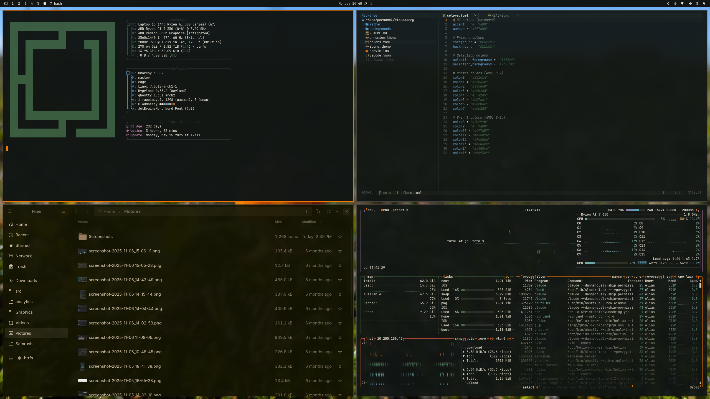
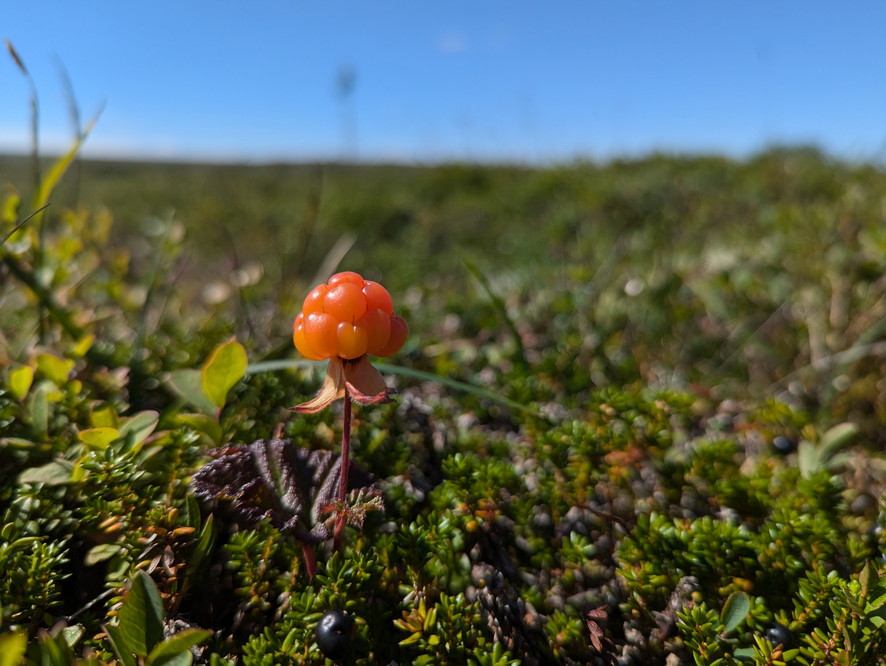

# Cloudberry

> Swedish name: *hjortron* — the orange berry of the bog.

A dark moss [Omarchy](https://omarchy.org/) theme with a cloudberry-orange
accent. Warm bone foreground, muted greens, sky blue, soft magenta on a
`#111614` background — sampled from a Swedish cloudberry field after rain.



## Install

```bash
omarchy theme install https://github.com/eliasfaltin/cloudberry-omarchy-theme.git
omarchy theme set cloudberry
```

Or open the theme switcher with `Super+Ctrl+Shift+Space` after install.

## Palette

| Role | Hex | |
| --- | --- | --- |
| Background | `#111614` |  |
| Foreground | `#e6e2d3` |  |
| Accent (cloudberry orange) | `#ff7a00` |  |
| Moss green | `#3a5d40` |  |
| Olive | `#c9b26d` |  |
| Sky blue | `#5fa2d5` |  |
| Cyan | `#7ec0ae` |  |
| Magenta | `#b07aa1` |  |
| Earth red | `#d3543c` |  |

Full 16-color ANSI palette in [`colors.toml`](colors.toml).

## Wallpapers

| | |
| --- | --- |
|  | **fulufjället** — Pixel snapshot from the Fulufjället plateau, the source for the palette. |
|  | **triple crown** — three ripe cloudberries crowning the moss. |

Cycle with `omarchy theme bg next`.

## Themed surface

Omarchy regenerates per-app configs from `colors.toml` at theme-set time, so
this repo ships only the bits omarchy can't template:

- `colors.toml` — palette source-of-truth (accent / cursor / selection + 16 ANSI)
- `backgrounds/` — both wallpapers
- `icons.theme` — `Yaru-wartybrown`
- `chromium.theme` — Chromium frame RGB
- `vscode.json` — VS Code extension target
- `neovim.lua` — LazyVim spec with the colorscheme inlined (incl. tuned
  `render-markdown.nvim` heading colors)
- `aether/Cloudberry.json` — [aether](https://github.com/bjarneo/aether)
  blueprint for users of that generator

Everything else (alacritty, btop, foot, ghostty, helix, hyprland, hyprlock,
kitty, mako, swayosd, walker, waybar, wofi) is generated by omarchy's
templates from `colors.toml`.

## Tweak it

- **Accent / borders:** edit `accent` in `colors.toml`.
- **Per-app override:** drop a file with the same name as one omarchy templates
  (e.g. `waybar.css`) into the repo and omarchy will use yours instead.
- **Icon theme:** swap `Yaru-wartybrown` for any installed Yaru variant
  (`pacman -Ql yaru-icon-theme`).

## Apply via aether

If you use [aether](https://github.com/bjarneo/aether) directly:

```bash
aether --import-blueprint aether/Cloudberry.json --auto-apply
```

## License

MIT — see [LICENSE](LICENSE).
